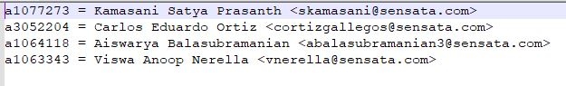

# SVN-to-GitHub-Migration-Tutorial-for-Mechanization-Sensata.

This tutorial is being written for exclusively migrating Sensata SVN Repositories to GitHub with History and Author mapping. 

* [Click here to navigate to the Primary GitHub tutorial source used for Migrating SVN to GitHub](https://github.github.com/enterprise-migrations/#/./2.2.4.4.4-svn-full-playbook?id=svn-migration-with-full-history)

Checklist prior to SVN TO GIT Migration - 
* SVN Command Line Tools
* Git-SVN Tool [Check out here](https://git-scm.com/docs/git-svn)
    * Add git-svn to the Environment variables
* Windows Power Shell (optional) [Download here](https://docs.microsoft.com/en-us/powershell/scripting/install/installing-powershell-on-windows?view=powershell-7.2)
* Enable Long directories creation on Windows Settings [Click here for the Link to Enable Long paths](https://www.howtogeek.com/266621/how-to-make-windows-10-accept-file-paths-over-260-characters/#:~:text=In%20Windows%2010%20Pro%20or,item%20and%20double%2Dclick%20it.)
* Git Tool [Click here to download](https://git-scm.com/downloads)
* Sensata Network Connection
* Access to create a new repository on appropriate GitHub Sensata organization. Get this rights approved by corresponding administrator for GitHub org.

Follow below steps to migrate a particular repository

Step 1 [Creating an authors mapping file](https://github.github.com/enterprise-migrations/#/./2.2.4.4.4-svn-full-playbook?id=step-1-creating-an-authors-mapping-file)
1. [Get the list of authors from the SVN repository](https://github.github.com/enterprise-migrations/#/./2.2.4.4.4-svn-full-playbook?id=svn-migration-with-full-history:~:text=Get%20the%20list%20of%20authors%20from%20the%20SVN%20repo)
    
2. [Once you have this file, modify it to the following format](https://github.github.com/enterprise-migrations/#/./2.2.4.4.4-svn-full-playbook?id=svn-migration-with-full-history:%7E:text=Once%20you%20have%20this%20file%2C%20modify%20it%20to%20the%20following%20format%3A:~:text=Once%20you%20have%20this%20file%2C%20modify%20it%20to%20the%20following%20format%3A)

3. Sample **Authors.txt** file is [here](https://github.com/ViswaAnoopNerella/SVN-to-GitHub-Migration-Tutorial-for-Mechanization-Sensata/blob/Documentation/authors.txt)  We should at some point create a global Mechanization **Authors.txt** file and make it available for everyone across our teams in different locations. You can add your team names to this file. Just add the details of who are actively working in the company. The email id and name should match the team members credentials/profile on GitHub.

> 

Step 2 [Initializing the Git Repository](https://github.github.com/enterprise-migrations/#/./2.2.4.4.4-svn-full-playbook?id=step-2-initializing-the-git-repository)
1. Initialize the Git repository with [git svn init](https://git-scm.com/docs/git-svn#Documentation/git-svn.txt-eminitem) first and running the actual migration with [git svn fetch](https://git-scm.com/docs/git-svn#Documentation/git-svn.txt-emfetchem) later allows more flexibility for migrating the history in chunks for very large repository. You can also combine it into one command using [git svn clone](https://git-scm.com/docs/git-svn#Documentation/git-svn.txt-emcloneem). We will be using [git svn init](https://git-scm.com/docs/git-svn#Documentation/git-svn.txt-eminitem) in this playbook to initialize an empty Git repository with additional metadata directories for **git svn**.

I customized this step to perform easily with a .sh script file. You can copy the script file from [GITSVNINIT](https://github.com/ViswaAnoopNerella/SVN-to-GitHub-Migration-Tutorial-for-Mechanization-Sensata/blob/Documentation/GITSVNINIT.sh) and modify the SVN repository link as per your need and save it before executing. In your SVN repository if the Trunk/Branches/Tags name are different thank in what we used in the script you will have to modify the .sh script file.
```bash
git svn init \
    --trunk=Trunk \
    --branches=Branches \
    --tags=Tags \
    "http://mech-svn.corp.sensata.com:86/svn/MechVault/Mechanization Machines/Giagfuse/190418-UnlatchCurrentTester#2"
```

Step 3 [Migrating the revisions](https://github.github.com/enterprise-migrations/#/./2.2.4.4.4-svn-full-playbook?id=step-3-migrating-the-revisions)
1. We’ll be using git svn fetch to migrate the revisions of the SVN repository to Git.

* For specific revision to revision, please use below 
```bash
git svn fetch -r<rev>:<rev>
```

* To fetch and pull all revisions 
```bash
git svn fetch
```


Step 4 [Pushing repository to GitHub](https://github.github.com/enterprise-migrations/#/./2.2.4.4.4-svn-full-playbook?id=step-4-pushing-repository-to-github)
1. Since git svn allows working with an SVN repository in a bidirectional way, it stores branches and tags, not as local branches and tags. Because of that, we need to push branches and tags in a special way. Via git show-ref you can see all the refs that have been created.

```bash
$ git show-ref
```

First, you need to create an **uninitialized** repository on GitHub and add it as a remote to your local Git repository: The **GITHUB_REPOSITORY_URL.git** in the below command is the url of actual git repository you created on github.com

```bash
git remote add origin GITHUB_REPOSITORY_URL.git
```

Then we’ll push up the master branch:

```bash
git push origin master
```

I made .sh bash scripts for pushing branches and tags with below code snippets. You can access those files [gitpushallbranches.sh](https://github.com/ViswaAnoopNerella/SVN-to-GitHub-Migration-Tutorial-for-Mechanization-Sensata/blob/Documentation/gitpushallbranches.sh) and [gitpushalltags.sh](https://github.com/ViswaAnoopNerella/SVN-to-GitHub-Migration-Tutorial-for-Mechanization-Sensata/blob/Documentation/gitpushalltags.sh) . When you execute these scripts, you do not need to modify anything.
Next we’ll push the branches:

```bash
for REF in $(git for-each-ref --format='%(refname)' refs/remotes/origin/ | grep -v /tags/); do
    BRANCH_NAME=${REF#refs/remotes/origin/}
    if [ "$BRANCH_NAME" != "trunk" ]; then
        echo "Push branch: $BRANCH_NAME"
        git push -u origin "$REF":refs/heads/$BRANCH_NAME
    fi
done
```

Finally we’ll push the migrated tags:

```bash
for REF in $(git for-each-ref --format='%(refname)' refs/remotes/origin/ | grep /tags/); do
    TAG_NAME=${REF#refs/remotes/origin/tags/}
    echo "Push tag: $TAG_NAME"
    git push -u origin "$REF":refs/tags/$TAG_NAME
done
```
STEP 5 [Validating the repository on GitHub](https://github.github.com/enterprise-migrations/#/./2.2.4.4.4-svn-full-playbook?id=step-5-validating-the-repository-on-github)
* Once you’ve pushed the repository to GitHub, we recommend validating if all commits, branches, and tags are correctly pushed. Additionally, we recommend to clone the repository and validate the project locally and test if it is running and working as expected. 